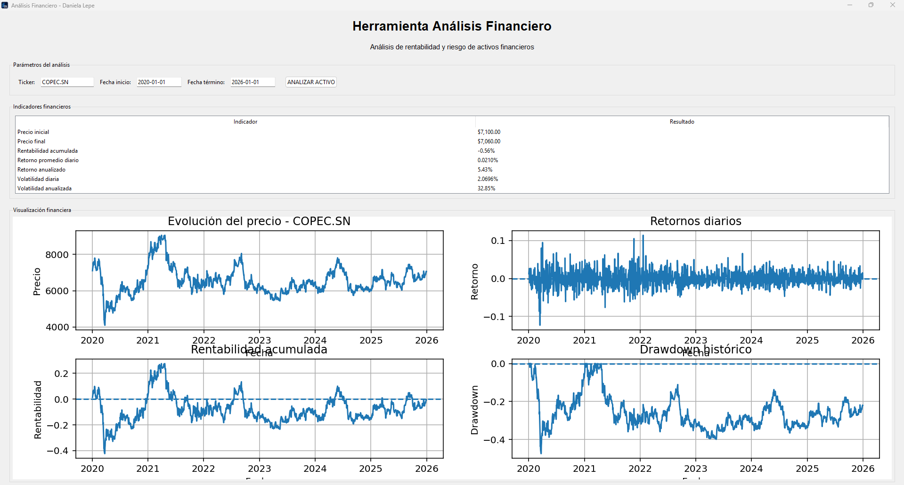

# 📊 Herramienta de Análisis Financiero en Python

Aplicación desarrollada en **Python** para analizar la rentabilidad y el riesgo de activos financieros a partir de datos históricos.

El proyecto permite seleccionar un activo financiero, definir un período de análisis y obtener automáticamente indicadores y visualizaciones que facilitan la interpretación de su comportamiento.

---

## 🖥️ Vista de la aplicación



---

## 🎯 Objetivo del proyecto

Desarrollar una herramienta que integre **programación, análisis de datos y finanzas**, permitiendo evaluar el comportamiento histórico de activos financieros mediante indicadores de rentabilidad y riesgo.

La aplicación busca transformar datos financieros en información clara y visual que pueda servir de apoyo para el análisis y la toma de decisiones.

---

## ⚙️ Funcionalidades

La aplicación permite:

- Seleccionar un activo financiero mediante su ticker.
- Definir un período de análisis.
- Descargar precios históricos.
- Calcular retornos diarios.
- Analizar rentabilidad acumulada.
- Calcular retorno promedio y anualizado.
- Calcular volatilidad diaria y anualizada.
- Identificar el mejor y peor retorno diario.
- Calcular VaR histórico al 95%.
- Calcular Drawdown máximo.
- Clasificar el nivel de riesgo del activo.
- Visualizar gráficamente los resultados.

---

## 📈 Indicadores financieros

Entre los principales indicadores calculados se encuentran:

| Indicador | Descripción |
|---|---|
| Rentabilidad acumulada | Variación total del activo durante el período |
| Retorno promedio diario | Promedio de los retornos diarios |
| Retorno anualizado | Estimación del retorno en términos anuales |
| Volatilidad | Medida de variabilidad de los retornos |
| VaR histórico 95% | Estimación de pérdida basada en la distribución histórica |
| Drawdown máximo | Mayor caída registrada desde un máximo acumulado |
| Nivel de riesgo | Clasificación basada en la volatilidad anualizada |

---

## 📊 Visualizaciones

La aplicación genera cuatro gráficos principales:

1. Evolución histórica del precio.
2. Retornos diarios.
3. Rentabilidad acumulada.
4. Drawdown histórico.

---

## 🛠️ Tecnologías utilizadas

- **Python**
- **Pandas**
- **NumPy**
- **Matplotlib**
- **Tkinter**
- **yfinance**

---

## ▶️ Ejecución

Para ejecutar el proyecto es necesario tener Python y las principales dependencias instaladas.

```bash
pip install yfinance pandas numpy matplotlib
python analisis_financiero.py
```

